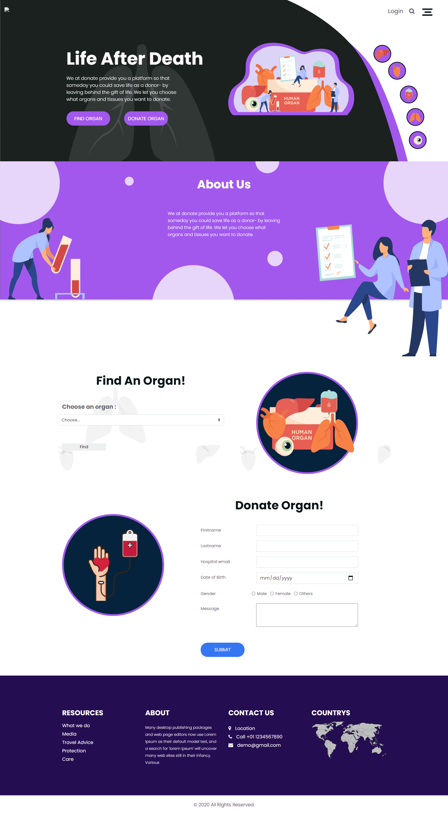

# Hackathons

## HackOff v3.0 🌟

HackOff, a one of a kind hack, where your innovation defines you. It shows how you wish your world to be today and where you see it in the future. A 36-hour long hackathon, HackOff is inviting young minds from all across the world to come together to put up the most magnificent show the digital realm has ever seen.

#### My first hacathon🙃

### Donate
**Problem statement open inovation in Health care**

Our project is a fullscale web application that is responsible for letting a hospital admin to add or delete organs(kidney, lungs, pancreas) to the database once an organ is donated or taken from a particular hospital. Our solution also includes Plasma during the COVID situations. Our application also allows a normal user interaction apart from the hospital admin. A normal user can send a message in the app if he wishes to donate organs/plasma. That message is directlty sent to the Hospital email through an API. Our user can also search for organs that he needs urgently. Once the user selects the particular organ that he needs, a thorough search is made in the database and if that particular organ is present in out database, then the name of the Hospital along with all the details of that organ(age of the person who donated, sex of the person who donated etc) is displayed.

This hackathon was a huge confidence booster for me and my team. We got a price of 5000Rs each with MLH merchendice, in our very first hackathons.

**Page view**

## EtherPunk 2021

A global online Ethereum hackathon, EtherPunk 2021 is a call to arms bringing together thousands of developers, industry experts, advisors, mentors, and companies to innovate and build decentralized applications with the potential of mass adoption.

### Smart Voter

> **[DevFolio Link](https://devfolio.co/submissions/smart-voter-5220)**

- Voting can be done from the comfort of one's home but without the risk of servers being hacked
- Identities of the voters are verified via data in the government/electoral commission's database
- No mapping between real world identity of the person and vote cast by him
- No possibility of booth rigging or casting votes in the name of people don't cast their votes
- Possibility of parties casting multiple voters checked by high transaction fee of voting.
- In the current pandemic situation, queuing up a large crowd can increase the chances of the virus spread. So our web application eradicates this problem as voters can vote online from their homes.

